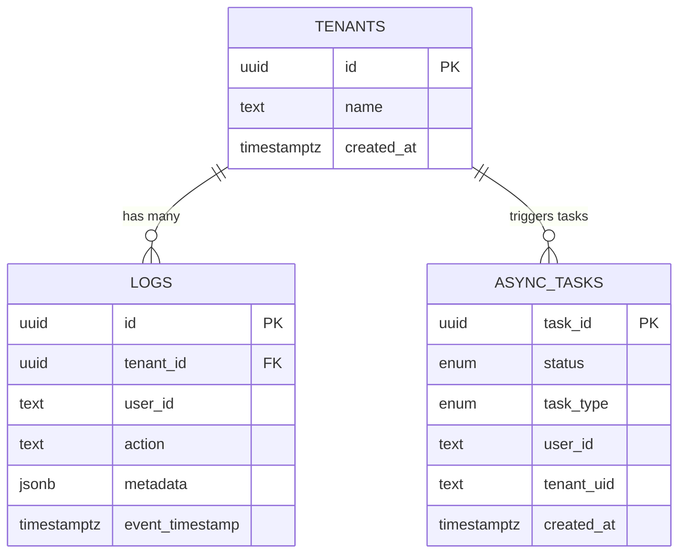

# Database Design: Audit Log API

- This document describes the **database schema** for the Audit Log API project.
- The system uses **PostgreSQL with TimescaleDB extension**, optimized for **multi-tenant, time-series audit log data**
---

## 1. Schema Overview

### `tenants` table
Stores tenant metadata for multi-tenant support.

| Column       | Type         | Description                         |
|--------------|--------------|-------------------------------------|
| `id`         | UUID         | Primary key, unique tenant ID       |
| `name`       | TEXT         | Tenant name                         |
| `created_at` | TIMESTAMPTZ  | Row creation timestamp              |
| `updated_at` | TIMESTAMPTZ  | Row update timestamp                |

---

### `logs` table
Stores audit log entries as a **TimescaleDB hypertable**, optimized for high-volume time-series workloads.

| Column          | Type        | Description                                    |
|-----------------|-------------|------------------------------------------------|
| `id`            | UUID        | Unique log ID (per event)                      |
| `tenant_id`     | UUID        | References `tenants(id)`, ensures isolation    |
| `user_id`       | TEXT        | ID of the user performing the action           |
| `session_id`    | TEXT        | Session identifier                            |
| `action`        | TEXT        | Action performed (CREATE, UPDATE, DELETE, …)  |
| `resource`      | TEXT        | Resource type (user, order, product, etc.)     |
| `resource_id`   | TEXT        | Resource identifier                           |
| `severity`      | TEXT        | Log severity (INFO, WARNING, ERROR, CRITICAL) |
| `ip_address`    | INET        | Client IP address                             |
| `user_agent`    | TEXT        | Client user agent                             |
| `message`       | TEXT        | Human-readable message                        |
| `before_state`  | JSONB       | Resource state before change                  |
| `after_state`   | JSONB       | Resource state after change                   |
| `metadata`      | JSONB       | Additional structured metadata                |
| `event_timestamp` | TIMESTAMPTZ | Event logical timestamp                     |

- **Primary Key**: (`tenant_id`, `event_timestamp`, `id`)  
- Ensures uniqueness and supports efficient time-series partitioning.
- Each log is tied to a `tenant_id` ensuring tenant isolation.
- **Foreign key with `ON DELETE CASCADE`** ensures log cleanup when a tenant is removed.  
- Async tasks also carry tenant scope for correct isolation.

---

### `async_tasks` table
Manages **background tasks** (archival, cleanup, reindexing, exports).

| Column       | Type              | Description                                |
|--------------|-------------------|--------------------------------------------|
| `task_id`    | UUID              | Primary key, unique task ID                |
| `status`     | ENUM              | Task state (`pending`, `running`, `succeeded`, `failed`) |
| `task_type`  | ENUM              | Task type (`log_cleanup`, `archive`, `export`, `reindex`) |
| `payload`    | JSONB             | Optional task payload                      |
| `created_at` | TIMESTAMPTZ       | Creation timestamp                         |
| `updated_at` | TIMESTAMPTZ       | Last update timestamp                      |
| `tenant_uid` | TEXT              | Tenant identifier (string form)            |
| `user_id`    | TEXT              | User who triggered the task                |
| `error_msg`  | TEXT              | Error message if task failed               |

---

## 3. TimescaleDB Features

### Hypertable
- `logs` is a **hypertable** 
    - Partitioned by `tenant_id` (multi-tenant support).
    - Time-based partitioning by `event_timestamp` in 1-day chunks.

### Compression
- Logs older than 30 days are automatically compressed.
- Compression strategy: order by `event_timestamp DESC`, segment by `tenant_id`.

---

## 4. Continuous Aggregates

### `log_stats_daily`
- A **materialized view** maintained by TimescaleDB continuous aggregates.
    - Aggregation Window: Daily (time_bucket('1 day', event_timestamp)).
    - Granularity: Per tenant_id, action, severity.
    - Indexing: Index on (tenant_id, day) ensures fast lookups.
    - Refresh Policy:
        - Maintains stats for the last 90 days.
        - Automatically refreshes every 5 minutes.
        - Ensures near real-time availability for dashboards and analytics.
        - Retention: Older aggregate data (>90 days) is dropped automatically.

---

## 5. Entity Relationships

