## 1. System Architecture Overview
- This diagram shows the complete system architecture and how all components
interact with each other.


## 2. Sequence flow
### 2.1 Create log flow


### 2.2 Log cleanup flow

```bash
task_id                             |status   |task_type  |payload|created_at                   |updated_at                   |tenant_uid                          |user_id |error_msg|
------------------------------------+---------+-----------+-------+-----------------------------+-----------------------------+------------------------------------+--------+---------+
844ecbda-e848-4e77-b55a-880a2dc8a42b|succeeded|reindex    |       |2025-08-24 10:14:30.586 +0700|2025-08-24 10:14:31.029 +0700|                                    |123e4567|         |
c45fdacf-a1b7-4070-8713-6908ad0704e5|succeeded|reindex    |       |2025-08-24 10:17:11.755 +0700|2025-08-24 10:17:11.955 +0700|                                    |123e4567|         |
57187837-01d4-4965-b9ca-80db9ea48396|succeeded|reindex    |       |2025-08-24 10:23:34.447 +0700|2025-08-24 10:23:34.667 +0700|                                    |123e4567|         |
9e4109ad-7014-4918-9bd7-401099422ac9|succeeded|archive    |       |2025-08-24 10:32:16.931 +0700|2025-08-24 10:32:17.218 +0700|c2e217a3-fe51-444c-a41c-6956c4c81d51|123e4567|         |
d3381dd4-b3a6-4c1d-9025-b31449fe435b|succeeded|log_cleanup|       |2025-08-24 10:32:17.220 +0700|2025-08-24 10:32:17.405 +0700|c2e217a3-fe51-444c-a41c-6956c4c81d51|123e4567|         |
```
- I created a async task table to tracking the progress of all background job (archival, indexing, cleanup)
    - Status: Pending, Running, Succeeded, Failed
    - Task_type: Log_cleanup, reindex, archive

### 2.3 Search log flow (advanced search)

```mermaid
sequenceDiagram
    participant Client as Client (API Caller)
    participant API as LogHandler (GET /api/v1/logs?filters)
    participant UC as SearchLogsUseCase
    participant Repo as LogSearchRepository (OpenSearch)
    participant OS as OpenSearch Cluster

    %% --- Request from client ---
    Client->>API: GET /logs?tenant_id&user_id&action&severity&q&page&page_size

    %% --- Handler builds filters ---
    API->>API: Parse query params<br/>Build LogSearchFilters
    API->>UC: Execute(ctx, filters)

    %% --- Usecase calls repository ---
    UC->>Repo: Search(ctx, filters)

    %% --- Repository builds query ---
    Repo->>Repo: buildQuery(filters, from)
    Repo->>OS: POST /index/_search<br/>with ES query JSON

    %% --- OpenSearch responds ---
    OS-->>Repo: Hits {total, logs[]}
    Repo-->>UC: SearchResult {Total, Logs}
    UC-->>API: SearchResult

    %% --- Handler maps to API response ---
    API->>API: Convert logs to DTO
    API-->>Client: 200 OK + {total, items, pageNumber, pageSize}
```
